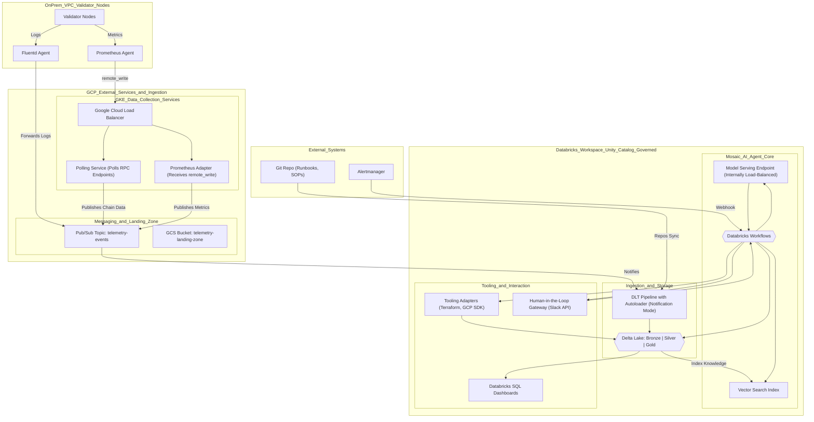

# ZoopX AgentOps — Production Architecture (HLD)

Last updated: 2025-08-21

## 1. Overview

ZoopX AgentOps is an autonomous SRE/DevOps agent for Web3 and cloud estates. It continuously ingests telemetry, reasons over current and historical system state, and executes guarded actions to maintain SLOs, perform lifecycle tasks, and remediate incidents. The core platform is built on Databricks Data Intelligence (Unity Catalog, DLT, Vector Search, Model Serving, Workflows) with GCP services for data collection and transport.

This document is the production-grade High-Level Design (HLD). It describes the end-to-end architecture, data flow, governance and security controls, non-functional requirements, and a phased implementation plan. Detailed interaction patterns are defined separately in `ZoopXAI_LLD.md`.

### Scope

- End-to-end data and control plane for the agent in production
- Ingestion from on-prem/VPC validator nodes via GCP
- Databricks-governed storage, indexing, reasoning, and orchestration
- Human-in-the-loop (HIL) approval and safe tool execution

### Out of scope

- Validator client implementation and chain protocol specifics
- Organization-wide SOC/SIEM architecture
- Cost accounting outside of this workload

## 2. Reference Architecture (Mermaid)



## 3. Component Breakdown

### On-Prem/VPC (Validator Nodes)

- Fluentd Agent: Tails structured logs; batches to Pub/Sub.
- Prometheus Agent: Scrapes node/validator metrics; remote_write to GKE ingress.

### GKE Data Collection Services

- Google Cloud Load Balancer: Single, scalable egress for Prometheus remote_write and RPC polling exposure.
- Polling Service (Python): Periodically queries blockchain RPC endpoints, normalizes events to JSON, publishes lightweight messages to Pub/Sub (pointer + metadata for GCS payloads when large).
- Prometheus Adapter: Receives remote_write, validates/normalizes timeseries, and republishes to Pub/Sub. Decouples producers from downstream ingestion, enabling buffering/backpressure.

### Messaging & Landing Zone

- Pub/Sub Topic telemetry-events: Durable, ordered-per-key event bus; used in notification mode for Autoloader. Carries descriptors (GCS URI, content type, schema version, tenant/env, checksum, size).
- GCS Bucket telemetry-landing-zone: Object storage for log bundles, metrics snapshots, and RPC polling payloads; lifecycle-managed; server-side encrypted.

### Databricks Ingestion & Storage

- DLT + Autoloader (Notification Mode): Consumes Pub/Sub notifications; structured ingestion to Delta Bronze; quality and schema enforcement to Silver; curated aggregates to Gold.
- Unity Catalog: Central governance for data, models, functions, and permissions; table-level and column-level controls; lineage.

### Mosaic AI Agent Core

- Vector Search: Indexes `knowledge_base_silver` for RAG over runbooks/SOPs.
- Model Serving: Managed endpoint for instruction-tuned model (e.g., `meta_llama_v_3_1_70b_instruct`); autoscaled; private networking.
- Databricks Workflows: Orchestrates enrich → reason → approve → execute loop; integrates with Slack/HIL and tools.

### Tooling & Interaction

- Tooling Adapters: Safe wrappers for Terraform, GCP SDK, Prometheus queries, validator management, etc.; enforce guardrails and audit logging.
- HIL Gateway (Slack): Approval/resume handshake with Workflow; idempotent callbacks.
- Databricks SQL Dashboards: SLO/SLA visualization over Gold tables (availability, attestation rate, missed proposals, latency, error budgets).

### External Systems

- Git Repo (Runbooks/SOPs): Synced to Databricks Repos to keep knowledge base fresh.
- Alertmanager: Triggers workflows via webhook with enriched alerts.

## 4. End-to-End Data Flow

1. Validators emit logs/metrics → Fluentd/Prometheus produce telemetry.
2. GKE services normalize and publish to Pub/Sub; large payloads are written to GCS and referenced by URI.
3. DLT Autoloader receives Pub/Sub notifications; ingests to Delta Bronze, then transforms to Silver/Gold with data quality checks.
4. Repos sync ingests runbooks → processed to `knowledge_base_silver` → indexed in Vector Search.
5. Alertmanager webhook starts Workflow → Enrich task joins runbook context + live metrics.
6. Reason task prompts Model Serving; returns structured plan/tool_call JSON.
7. HIL Gateway posts Slack approval; on approval Workflow resumes.
8. Execute task invokes Tooling Adapters; results logged to Delta and surfaced in dashboards.

## 5. Interfaces and Data Contracts

### Pub/Sub message (notification-mode) contract

```json
{
  "version": "1.1",
  "event_type": "metrics|logs|chain_event",
  "gcs_uri": "gs://telemetry-landing-zone/path/to/object.json.gz",
  "content_encoding": "gzip",
  "content_schema": "zoopx.telemetry.v1",
  "source": {
    "validator_id": "val-123",
    "cluster": "prod-gke",
    "chain": "ethereum",
    "region": "us-central1"
  },
  "ingest_ts": "2025-08-21T12:34:56Z",
  "checksum": "sha256:...",
  "size_bytes": 1048576
}
```

### GCS object naming convention

```
<env>/<chain>/<validator_id>/<event_type>/dt=<YYYY-MM-DD>/hr=<HH>/<uuid>.json.gz
```

### Delta tables (illustrative)

- Bronze: raw envelope + payload as VARIANT; partitioned by date/hour.
- Silver: normalized columns (timestamp, validator_id, metric_name, value, labels, src_uri, schema_version).
- Gold: aggregates per validator/SLO windows; materialized views for dashboards.

## 6. Security, Compliance, and Governance

- Identity and Access: Least-privilege IAM for GCP and Databricks; service principals for GKE publishers; UC grants for tables, models, and functions.
- Secret Management: Use Databricks secrets scopes and GCP Secret Manager; never embed secrets in code or notebooks.
- Network Controls: Private Service Connect/peering; restrict Model Serving to workspace VNet; egress allowlists from GKE.
- Encryption: TLS in transit; server-side encryption at rest (GCS, Delta); optional CMEK.
- Data Governance: Unity Catalog lineage, auditing, and PII classification (if applicable); schema evolution with explicit policies.
- Change Control: GitOps for code; CI checks; two-person review for production changes; promotion via environments.

## 7. Reliability and Performance

- Availability Targets: Core ingestion ≥ 99.9%; Model Serving ≥ service SLO; Slack/HIL is best-effort but Workflow retries on callback failures.
- Delivery Semantics: At-least-once ingestion; idempotent processing in DLT; dedupe on `(gcs_uri, checksum)`.
- Backpressure: Pub/Sub buffering; Autoloader scaling; DLT cluster autoscaling.
- Latency: Alert-to-approval under typical load ≤ minutes; batch RAG indexing not on critical path.
- DR/BCP: Cross-zone GKE; multi-zone GCS buckets; daily table backups/snapshots; restore runbooks.

## 8. Observability and Operations

- Metrics: Ingestion lag, DLT throughput, VS QPS/latency, model latency, approval latency, tool success rate, error budget burn.
- Logs: Structured JSON logs with correlation IDs (transaction_id, alert_id); retained per policy.
- Traces: Optional OpenTelemetry across Workflow tasks and adapters.
- Runbooks: Stored in repo; surfaced via RAG; include rollback and validation steps.
- Oncall: Pager rules based on SLOs; dashboards in Databricks SQL.

## 9. Cost and Capacity

- Optimize Autoloader notification mode to avoid directory listing costs.
- Right-size model endpoints; prefer autoscaling with min instances near zero off-hours.
- Compact Delta (OPTIMIZE/ZORDER) for query efficiency; schedule VACUUM and retention policies.
- Monitor Pub/Sub egress and GKE pod scaling; apply budgets and alerts.

## 10. Phase 1 Implementation Plan (Deliverable-Focused)

### Sub-Phase 1: Foundational RAG Agent MVP

- Deliverable: Databricks notebook demonstrating end-to-end RAG from runbooks → remediation plan.
- Dependencies: Databricks ML persona + Unity Catalog; Git repo with ≥5 runbooks (Markdown).
- Tech: Databricks (UC, Repos, DLT), Mosaic AI (Vector Search, Model Serving `meta_llama_v_3_1_70b_instruct`), Python.
- Acceptance:
  - `knowledge_base_silver` populated via DLT.
  - Vector Search index serving queries on `knowledge_base_silver`.
  - Model endpoint deployed and callable.
  - Notebook executes: sample alert → VS query → coherent remediation plan.

### Sub-Phase 2: Automated Telemetry & Alert Enrichment

- Deliverable: Automated Workflow that enriches alerts with static (runbooks) + dynamic (live metrics) context.
- Dependencies: Sub-Phase 1 complete; access to GCS and Pub/Sub; Alertmanager webhook.
- Tech: GCP (GCS, Pub/Sub), Databricks (DLT, Workflows, SQL).
- Acceptance:
  - DLT ingests logs/metrics to Bronze/Silver/Gold.
  - SQL dashboard visualizes validator SLOs.
  - Workflow triggered by test Alertmanager webhook.
  - Enrichment payload persisted to Delta.

### Sub-Phase 3: Closed-Loop Action & Human Approval

- Deliverable: End-to-end agent with Slack approval and execution of tool calls.
- Dependencies: Sub-Phase 2 complete; Slack workspace + API credentials.
- Tech: Python tooling adapters; Databricks Workflows; Slack API.
- Acceptance:
  - ≥2 adapters (e.g., `query_prometheus`, `restart_validator_client`) implemented and unit-tested.
  - Prompt includes tool schemas; model returns valid `tool_call` JSON.
  - Slack approval posts and resumes Workflow on click.
  - Tool executes with correct params; results logged.

### Sub-Phase 4: Expert Model Fine-Tuning & Evaluation

- Deliverable: Fine-tuned model outperforming baseline RAG; evaluation report; deployed to production.
- Dependencies: Sub-Phase 3 complete; dataset with ≥50–100 (problem_context → expert_tool_call) examples.
- Tech: Databricks GPU cluster, MLflow Model Registry; Mosaic AI Evaluate; Python (trl, transformers, mlflow).
- Acceptance:
  - `finetuning_dataset` meets quality bar.
  - Fine-tuning runs; new model version logged.
  - Staging endpoint deployed.
  - Evaluate shows statistically significant quality/safety improvement on holdout.
  - Model promoted to Production and swapped into Workflow.

## 11. Risks and Mitigations

- Model hallucination → Guardrails with strict tool JSON schema, allow-list tools, HIL mandatory for destructive ops.
- Telemetry spikes → Pub/Sub buffering, autoscaling DLT, backoff/retries.
- Schema drift → Contract versioning; schema registry pattern; validation in DLT.
- Secret leakage → Centralized secrets; token redaction in logs; scoped access.
- Approval delays → Escalation routing; timeouts with auto-cancel; safe defaults.

## 12. Environments and Promotion

- Envs: dev → staging → prod; separate workspaces and GCP projects where possible.
- Data: Dev/staging use scrubbed subsets; no production secrets or PII.
- Promotion: Git tags and CI pipelines; infra via Terraform; Databricks jobs via Workflows API.

## 13. Glossary

- DLT: Delta Live Tables. Autoloader: file/stream ingestion with notification mode.
- HIL: Human-in-the-loop approval.
- RAG: Retrieval-Augmented Generation.
- VS: Vector Search; MS: Model Serving; WF: Workflows.
