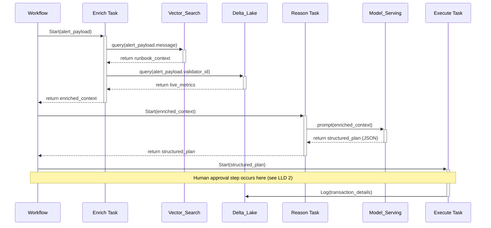
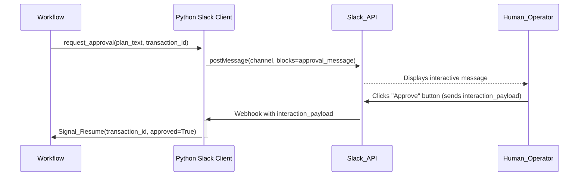

# ZoopX AgentOps — Low-Level Designs (LLDs)

Last updated: 2025-08-21

This document defines the core interaction patterns, message contracts, safety checks, and operational behaviors that implement the High-Level Design in `ZoopX-AI.md`.

## Contents

- LLD-1: Backend Reason–Act Loop (Workflow)
- LLD-2: Human-in-the-Loop (Slack) Approval
- LLD-3: Safe IaC Execution (Terraform Adapter)
- LLD-4: Prompting and Tool-Call Validation
- Shared: IDs, retries, error handling, and audit

---

## LLD-1: Backend Reason–Act Loop (Workflow)

### Sequence



### Contract (inputs/outputs)

- Input: `alert_payload` (JSON). Required: `alert_id`, `validator_id`, `severity`, `message`, `fired_at`, optional `labels{}`.
- Output: `transaction_log` row in Delta with correlation keys `(alert_id, transaction_id)`.

### Core invariants and checks

- Every plan must include explicit tool calls or "no-op" with justification.
- All tool calls must be from the allowlist and conform to JSON Schema (see LLD-4).
- Execution is blocked until HIL approval is recorded (approve/deny/timeout).
- All steps are idempotent; retries are safe (use `transaction_id`).

### Edge cases

- Missing validator_id → fall back to generic runbook context; mark `context_quality="degraded"`.
- Multiple alerts correlated to same validator within short window → coalesce; avoid duplicate actions.
- Model timeout → backoff/retry with jitter; surface to HIL if repeated failures.

---

## LLD-2: Human-in-the-Loop (Slack) Approval

### Sequence



### Message blocks (simplified)

```json
{
  "channel": "#ops-approvals",
  "blocks": [
    {
      "type": "section",
      "text": { "type": "mrkdwn", "text": "*ZoopX Plan Review*\n${summary}" }
    },
    { "type": "divider" },
    {
      "type": "section",
      "fields": [
        { "type": "mrkdwn", "text": "*Alert ID*\n${alert_id}" },
        { "type": "mrkdwn", "text": "*Validator*\n${validator_id}" },
        { "type": "mrkdwn", "text": "*Severity*\n${severity}" },
        { "type": "mrkdwn", "text": "*Risk*\n${risk_level}" }
      ]
    },
    {
      "type": "actions",
      "elements": [
        {
          "type": "button",
          "text": { "type": "plain_text", "text": "Approve" },
          "style": "primary",
          "value": "approve:${transaction_id}"
        },
        {
          "type": "button",
          "text": { "type": "plain_text", "text": "Reject" },
          "style": "danger",
          "value": "reject:${transaction_id}"
        },
        {
          "type": "button",
          "text": { "type": "plain_text", "text": "Open Plan" },
          "url": "${plan_url}"
        }
      ]
    }
  ]
}
```

### Behavior and safeguards

- Only approvers in an allowlist can approve; Slack user IDs are validated.
- Approvals are single-use; subsequent clicks are no-ops with helpful messages.
- Timeouts cancel execution and post status back to the channel.
- All interactions are signed and verified (Slack signing secret).

---

## LLD-3: Safe IaC Execution (Terraform Adapter)

### Sequence

```mermaid
sequenceDiagram
    participant Execute_Task as Notebook Execute Task
    participant Terraform_Adapter as Python Tool
    participant Shell_Runner as Subprocess Runner
    participant GCS_Bucket as Terraform State Backend

    Execute_Task->>+Terraform_Adapter: run_terraform_plan(module, vars)
    Terraform_Adapter->>+Shell_Runner: execute("terraform init")
    Shell_Runner-->>-Terraform_Adapter: return init_success
    Terraform_Adapter->>+Shell_Runner: execute("terraform plan -out=tfplan -detailed-exitcode")
    Shell_Runner-->>-Terraform_Adapter: return plan_output, exit_code
    Terraform_Adapter->>+GCS_Bucket: upload("tfplan")
    Note over Terraform_Adapter: Plan is parsed for safety checks (no destructive changes unless explicitly allowed).
    Terraform_Adapter-->>-Execute_Task: return {plan_url, changes_detected}
    Note over Execute_Task: Human reviews plan URL as part of approval.
    Execute_Task->>+Terraform_Adapter: apply_terraform_plan(plan_url)
    Terraform_Adapter->>+GCS_Bucket: download("tfplan")
    Terraform_Adapter->>+Shell_Runner: execute("terraform apply tfplan")
    Shell_Runner-->>-Terraform_Adapter: return apply_logs
    Terraform_Adapter-->>-Execute_Task: return {status: "success", logs: apply_logs}
    deactivate Terraform_Adapter
```

### Safety checks

- Parse plan JSON for `delete`/`replace` actions; reject unless change ticket is linked and risk level permits.
- Enforce runtime guards: max affected resources, blast-radius labels, and environment allowlist.
- Log command, args, masked environment vars, and diffs to Delta with correlation IDs.

### Configuration

- Remote state backend: Terraform GCS backend with workspaces per environment.
- IAM: Adapter runs under a constrained service account; least privilege; short-lived tokens.
- Artifacts: Plans and logs stored in GCS with retention and legal hold options.

---

## LLD-4: Prompting and Tool-Call Validation

### Prompt assembly

- Inputs: `alert`, `runbooks` chunks from Vector Search, `metrics` summary, `tools_schema`.
- Template enforces:
  - Always return JSON with keys: `summary`, `risk_level`, `tool_calls[]`.
  - Each `tool_call` requires `name`, `reason`, `params` (validated against JSON Schema); no free-text commands.
  - Provide rollback and verification steps for each action.

### Example tool schema (excerpt)

```json
{
  "$schema": "https://json-schema.org/draft/2020-12/schema",
  "$id": "https://zoopx.ai/schemas/tool.query_prometheus.json",
  "title": "query_prometheus",
  "type": "object",
  "properties": {
    "query": { "type": "string", "minLength": 1 },
    "timeRangeMinutes": { "type": "integer", "minimum": 1, "maximum": 1440 },
    "step": { "type": "string", "pattern": "^[0-9]+(s|m|h)$" }
  },
  "required": ["query", "timeRangeMinutes"],
  "additionalProperties": false
}
```

### Response validation

- Parse LLM response; validate each `tool_call.params` against schema.
- Reject unrecognized tools; request model to regenerate with nudge prompt.
- On repeated invalid output, escalate to human with context.

---

## Shared: IDs, Retries, Errors, and Audit

### Correlation IDs

- `alert_id`: From Alertmanager; propagated end-to-end.
- `transaction_id`: UUID per Workflow run; used for idempotency and Slack callbacks.
- `plan_id`: Hash of normalized tool_calls; aids deduplication.

### Retries

- Exponential backoff with jitter for network calls (Pub/Sub, Slack, Model Serving).
- Max attempts configurable per adapter; all adapters must be idempotent.

### Errors

- All failures return structured errors: `{code, message, retryable, details}`.
- Critical errors page oncall; non-critical errors annotate dashboards.

### Audit and Logging

- Log every decision: prompt hash, selected context IDs, model version, tool allowlist at time of execution.
- Record approvals with Slack user, timestamp, and message permalink.
- Store artifacts (plans, logs) with WORM-capable retention when required.

---

## Appendix: Example Data Models

### Delta: knowledge_base_silver (columns)

- `chunk_id` STRING, `doc_id` STRING, `title` STRING, `chunk_text` STRING, `source_path` STRING, `updated_at` TIMESTAMP, `embedding` ARRAY<FLOAT>, `tags` MAP<STRING,STRING>

### Delta: telemetry_silver (columns)

- `ts` TIMESTAMP, `validator_id` STRING, `metric` STRING, `value` DOUBLE, `labels` MAP<STRING,STRING>, `src_uri` STRING, `ingest_ts` TIMESTAMP

### Delta: transactions (columns)

- `transaction_id` STRING, `alert_id` STRING, `validator_id` STRING, `plan_json` STRING, `approved_by` STRING, `started_at` TIMESTAMP, `completed_at` TIMESTAMP, `status` STRING, `logs_uri` STRING
